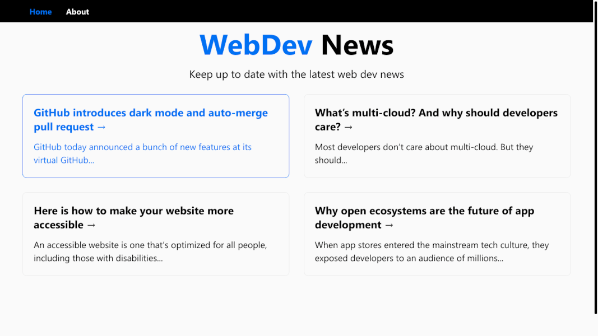

# Next.js Dev News

> Simple Dev news blog built with Next.js (not markdown based yet).

<h2 align="center">
  
  <br>
</h2>

### Run the development server:

```bash
npm run dev
```

### Build for production AND generate static website into "out" folder:

```bash
npm run build
```

### Run in production:

```bash
npm start
```

### API Routes:

GET /api/articles
GET /api/articles/:id
